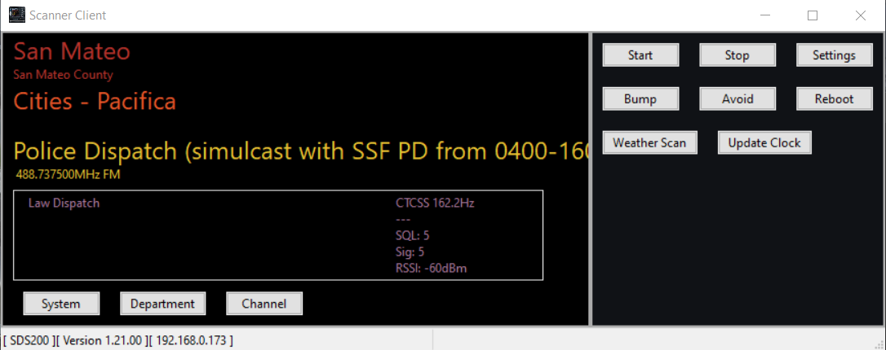

# Cross-Platform Uniden Scanner Client




ScannerClient is a very simply client that provides visual scanner status and audio streamed over IP.  This has enabled me to leave my SDS200 in the cold garage connected to a discone antenna on the roof while I listen anywhere inside my warm house.

ScannerClient makes no attempt to "program" the scanner, it is a simple program for listening with limited control functionality.

A short demo video is provided (ScannerClientDemo.mp4).

Internal design has the following major threads of execution:
1. Real Time Streaming Protocol (RTSP) management.
2. Real-time Transport Protocol (RTP) management.
3. Status update using PSI command.
4. Audio using rtaudio.
5. GUI using wxWidgets.

Written with C++20.

License is GPL2.0+.

# Some Background on Buttons
- **Settings** - update the IP address of your scanner first under General settings.
- **Start** - causes scanner client to connect to the scanner.
- **Stop** - disconnects.
- **System** - toggles hold on the current System.
- **Department** - toggles hold on the current Department.
- **Channel** - toggles hold on the current Channel.
- **Bump** - causes scanner to resume scanning.
- **Avoid** - just like the avoid button on the scanner.
- **Reboot** - will reboot your scanner.  Use this when the scanner gets hinky and ScannerClient can't connect to it.
- **Weather Scan** - scans the weather frequencies.  Use the System button to resume scanning normally.
- **Update Clock** - updates the scanners clock with your computer's system date/time.
- **CTRL Key** - same as the Bump button.
- **SPACE key** - same as the Channel button.


# Caveats
1. Currently built and run on Windows. Linux and OSX are in progress.  All components used by ScannerClient were selected because they run on all three platforms.  Getting Linux and OSX running takes priority over more features.
2. Requires an IP link to the scanner.  This can be wired or wifi.
3. Only tested with the Uniden SDS200.  Tested both cable connection between scanner and router,  and using a wifi dongle connected to the router.  In both cases the Windows 10 computer was connected to the router over wifi.
4.  Testing has been limited.  I'm one person.
5.  Many capabilities and functions of the scanner have not been implemented.
6.  If you get the "Advanced" settings confused, delete the sc.cfg file re-enter your IP address.  The defaults will be restored.
7.  Windows security will stop the program the first time you run it.  When prompted, authorize the program to run and Windows will not repeat.
8. If you've got the network and IP address correct, but ScannerClient is not connecting, try rebooting the scanner.  Often the audio service on the scanner will stop working because it didn't receive a valid termination of the RTSP session.

# Build Steps For Windows

#### Prerequisites
1. Install Visual Studio 2022 Community Edition. During installation with the 'Visual Studio Installer' make sure you select at least the C++ Desktop development category or you'll be unable to compile the project due to the missing C++ tools.
2. Install cmake.
3. Install and build wxWidgets for static release (without DLL).  Download https://github.com/wxWidgets/wxWidgets/releases/download/v3.2.1/wxWidgets-3.2.1.zip and unzip it to somewhere such as C:\MSVCDev\wxWidgets.  
 Navigate to C:\MSVCDev\wxWidgets\build\msw (or wherever you extracted) and open wx_vc17.sln.  
Choose Release and x64 for the build configuration and "Build Solution". All should compile successfully and you can close the project.  You may need to setup environment variables to enable cmake to find wxWidgets.

### To generate:
```bash
cmake -DCMAKE_BUILD_TYPE=Release -S . -B ./build
```
### To build:
```bash
cmake --build ./build --config Release
```
Note: do the above from the top level ScannerClient directory.

# Build for Linux
#### Prerequisites
1. Build and install wxWidgets.  Follow https://docs.wxwidgets.org/3.2.0/overview_cmake.html directions.
2. Set wxWidgets_DIR to the directory containing the wxWidgetsConfig.cmake file.  For example in CMakeLists.txt:
SET(wxWidgets_DIR ~/wx_install/lib/cmake/wxWidgets/wxWidgetsConfig.cmake)
### To generate:
```bash
cmake -S . -B ./build -DCMAKE_BUILD_TYPE=Release -DwxWidgets_CONFIG_EXECUTABLE=~/repos/wxWidgetsBuild/wx-config
```
### To build:
```bash
cmake -S . -B ./build


## RFCs and References Used In Development

#### Real-Time Streaming Protocol
https://www.rfc-editor.org/rfc/rfc7826#page-25
https://www.w3.org/2008/WebVideo/Fragments/wiki/UA_Server_RTSP_Communication
https://www.cs.columbia.edu/~hgs/rtsp/draft/draft-ietf-mmusic-rtsp-03.html#SECTION00020000000000000000

#### Real-Time Transport Protocol
https://www.rfc-editor.org/rfc/rfc3550#page-4

#### G.711 Codec
https://en.wikipedia.org/wiki/G.711

#### ITU Software Tools Library on Github
https://github.com/openitu/STL


 